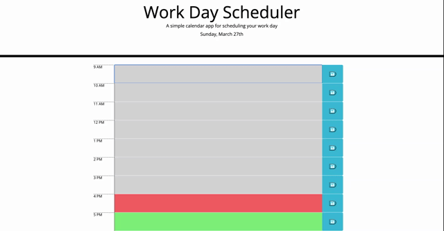
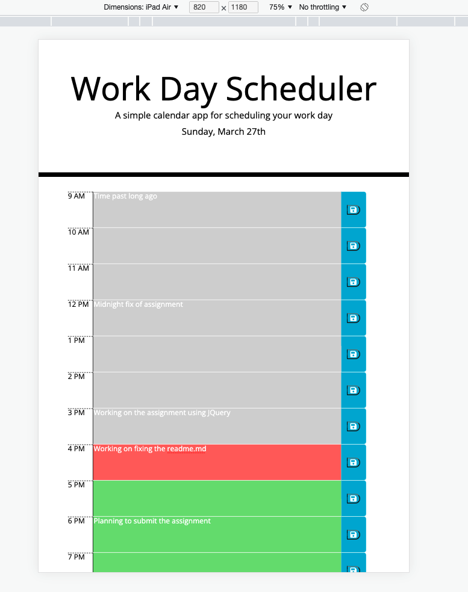

# Workday Calendar

This is simple calendar application allowing any employee to save events for each hour of the day by modifying starter code. This web applocation runs in the browser and feature dynamically updated HTML and CSS using JQuery. This application is made mobile responsive using BootStrap grid model.

Used moment.js library to work with time in this web application. Using browser APIs, created and manipulated HTML elements, added event listeners, stored and retrieved data into/from localStorage.

# Tech Stack
- HTML
- CSS 
- Javascript 
- BootStrap

# Application Details

GH Repo @ https://github.com/rajeswarivmarimuthu/workday-scheduler
 
Deployed @ https://rajeswarivmarimuthu.github.io/workday-scheduler/

# Demo 
## Desktop 

## Mobile responsive layout

